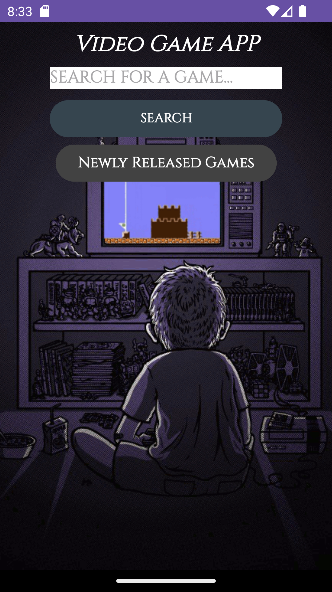
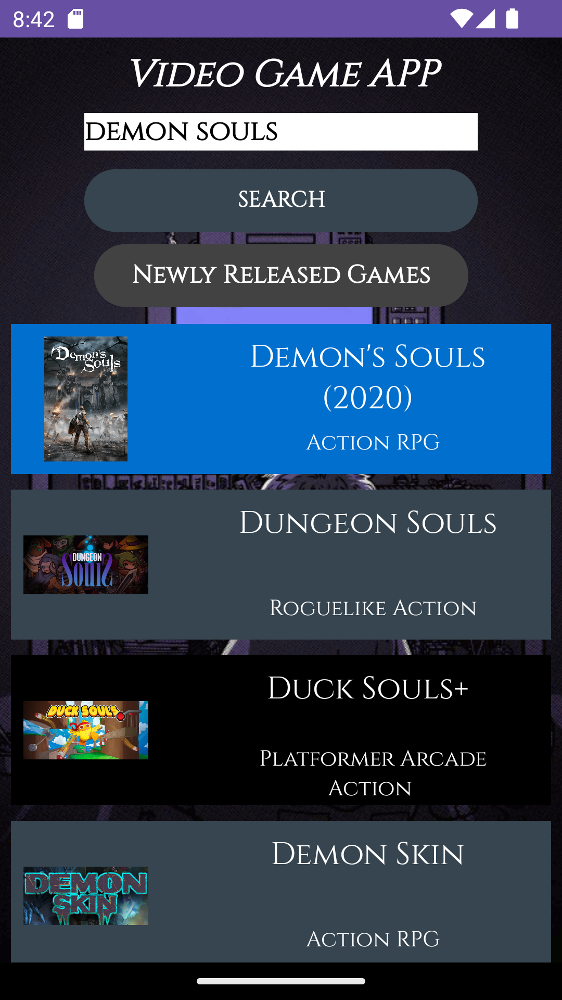
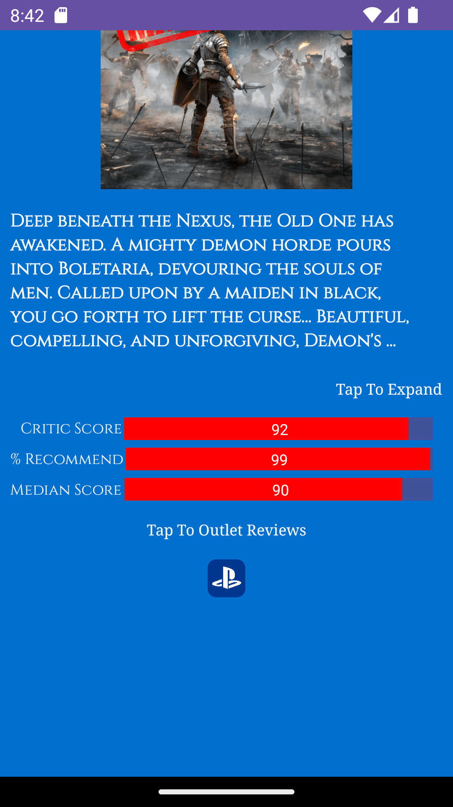
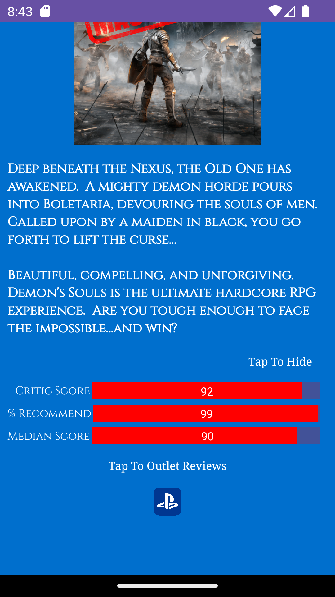
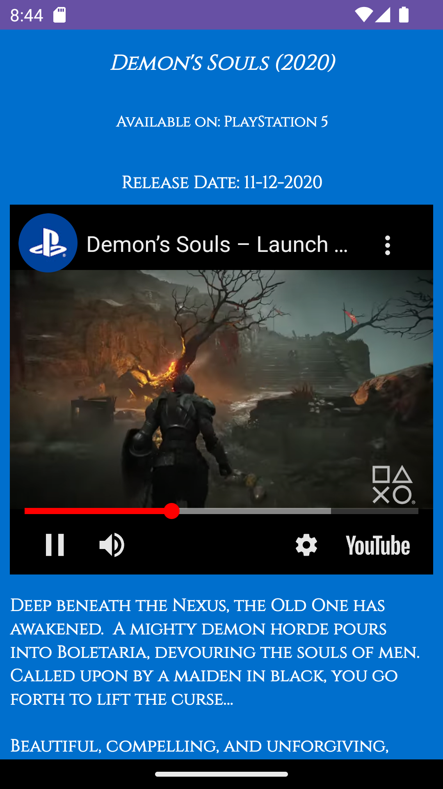
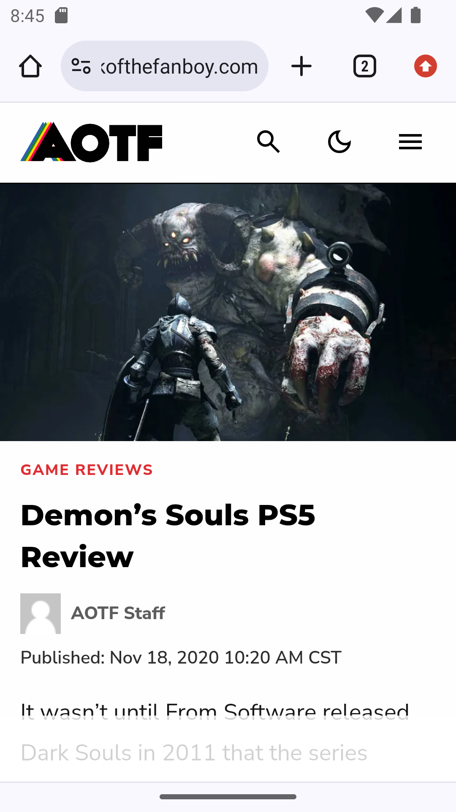
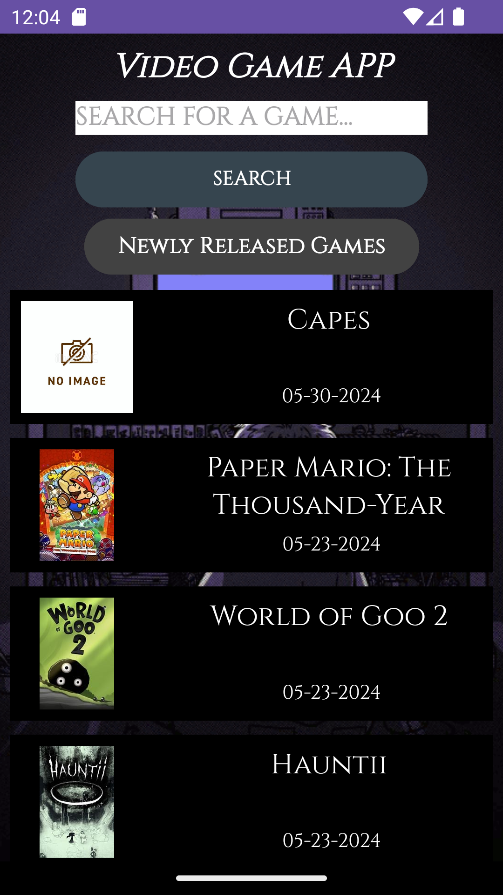

Gaming application that retrieves video game data, reviews, platform availability, and more. Application can also retrieve newly released games. Items are displayed in an interactive recyclerView.

# App Startup

# Game Search

# Detailed Game Info

# Game Story Expanded

# Visiting Displayed Console Icon's Website

# Game Images and Video in ViewPager

# Outlet Reviews Activity

# Going To Outlet's Website

# Displaying Newly Released Games

